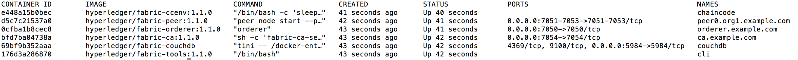
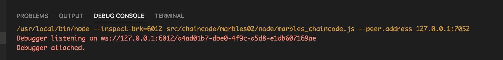

# Hyperledger Fabric Application Development with an IDE
## Background
This set of tools and document provides a simpler and 21st century way of developing a blockchain application. This is a continuation of a work that was managed in HL fabric 0.5 and 0.6 with Eclipse and Jetbrain Intellij. Within this huge gap Jetbain dropped the support of GOLang development of the Intellij Community edition  and introduced a product called GOLand which looks expensive to deploy for many open source developers. Unfortunately Eclipse support for GOClipse has not improved since, which originally triggered the use of a Jetbrain Product. During this gap Microsoft was able to fill the gap in GO development in Visual Studio Code, however GO 1.10.x and so far GO 1.11.x both  break when trying to debug GO in VSCode. 

With the introduction of JavaScript Chaincode, VSCode plays a more important role as a full stack development tool for HL fabric. The focus of this documnet is to build:

1. An enviornmonet for chaincode development. This Environment was derived from <b>Basic Network </b>of Hyperledger Fabric 1.1 which supports CouchDB, and added DEV mode. The native Fabric 1.1 DEV mode does not support CouchDB and uses LevelDB instead.
2. Focus on Javascript which has no debugging limitation, while using Eclipse for GO development, old fashioned way.


## Setting up the environment

### In a nutshell

* All Docker images of HL fabric is loaded
* The credentials of Chanicode Docker is moved to Mac
* The sample Chincodes (Sacc for GO and Chaincode02 for Javascript) are deployed through the CLI docker instance

### Steps
#### Installation ####

* Install [pre-requsites](https://hyperledger-fabric.readthedocs.io/en/release-1.1/prereqs.html) on your Mac. Note that GoLang 1.9 breaks with Fabric 1.1 due to docker go libraries which are compiled with  goLang 10.x.

* You need [Git](https://git-scm.com/download/mac) on Mac, if it is not already installed.

* Install [Visual Studio Code](https://code.visualstudio.com/), if it is not already installed.


#### Configuration ####
* clone git repository
```
git clone https://github.com/shsedghi/HL_Fabric_IDE
cd HL_Fabric_IDE
```
* The follwing steps build s the environment. if your network is slow, the channel creation may fail, you need to redo this step.
```
./start_dev.sh
```
* After succesful start you can stop, and clean the environment with. Any changes to docker containers will be lost
```
 ./stop_dev_sh
```
* You can delete the whole environment with (wtach out if you have other HL images)
```
 ./teardown_dev.sh
```
* After successful start up:
```
 docker ps
```


* In this stage we copy goPath and local MSP from Chaincode Docker into Mac. You need to setup  enevironemnt varaibles to point to both. 

```
docker cp chaincode:/opt/gopath ~/gopath
docker cp chaincode:/etc/hyperledger/msp /etc/hyperledger/msp
```
* Modify your .bash_profile and include the following environment varaibles. You need to logout and log back in for the chages take effect.
```
GOPATH=~/goPath
CORE_PEER_LOCALMSPID=DEFAULT
export  GOPATH CORE_PEER_LOCALMSPID 
```

* Build the required libraries for Java script chaincode02 by:
```
cd $GOPATH/src/chaincode/chaincode_example02//node/
npm install
```
* Open VSCode 
* Open ~/goPath
* Browse to src/chaincode/chaincode_example02//node/
hirarchy should look like this [picture](images/VScode.png)

* Double click on chaincode_example02.js to open
* From File &rightarrow; Debug &rightarrow; Open Configuration and modify or replace it as this [Config File](lunch_js.json) 
* save the Config file
* Start the chaincode from File &rightarrow; Debug &rightarrow; Strat Debugging. Debug console will show as follows:

### Install and Instantiate Chaincode
Chaincode Install in DEV mode is only used for Metadata creation (including CouchDB indexes) but is required even if it is started manually

```
docker exec -it cli bash
peer chaincode install -n mycc -v 0 -l node -p /opt/gopath/src/chaincode/chaincode_example02/node
peer chaincode instantiate -n mycc -v 0 -l node  -c '{"Args":["init","a", "100", "b","200"]}' -C mychannel
```
if you get the following error, during instantiate, it means your network start was not fast enough (60 seconds) to create the channel. Stop and start the neworks using scripts and repeat the configuraton steps.

```
Error: Error getting (mychannel) orderer endpoint: error endorsing GetConfigBlock: rpc error: code = Unknown desc = chaincode error (status: 500, message: "GetConfigBlock" request failed authorization check for channel [mychannel]: [Failed to get policy manager for channel [mychannel]])
```

### Run a Query
```
peer chaincode query -C mychannel -n mycc -c '{"Args":["query","a"]}'


### Modifiy the code
Alternatively you can stop debugging, modify the  code and restart the app without redeploying the chaincode. DEV mode allows modifiying the chaincode indefinitly without redeplying it. The following will allow access to X509 certificate of the chaincode caller:

Open Terminal window in VSCode View &rightarrow; Terminal

```
cd $GOPATH/src/chaincode/chaincode_example02/node
npm install x509
```

* replace or modify the chaincode_example02.js with the [sample](samples/chaincode_example02.js) provided and save the file.

*  Restart the chaincode from File &rightarrow; Debug &rightarrow; Strat Debugging
*  Rerun the query from the cli command line

# Running GOLang chaincode in Eclicps

TBD


